# Example gallery

Every script in [`examples/`](../../examples) rendered to SVG and PNG. The PNG is
shown inline (raster, 2400 px wide); the SVG beside each heading is the real
output: vector, searchable text, and what `fs.render("…svg")` actually writes.

These are **generated, not hand-drawn**. One command rebuilds all of them:

```bash
python scripts/gallery.py
```

`tests/test_gallery.py` renders every example and compares, so a sheet left
stale fails the suite instead of sitting on `main` showing a drawing the package
has stopped producing.

The generator imports each example with `Flowsheet.render` stubbed, taking the
flowsheet the script built rather than the file it writes, and draws it under
the example's own stem — so there is no copy and no rename to get wrong. Run an
example yourself and it still writes its own name into `examples/` (gitignored):
`03_distillation_train.py` writes `distillation_train.svg`, and
`01_ammonia_loop.py` writes `ammonia_auto.svg`. `11` writes an
`ethanol_pid.drawio` as well, which is the draw.io export and not a second
sheet; the generator passes that write over.

The PNGs are rasterized from the *committed* SVGs, through
`pandid.render.export` (the `[pdf]` extra), so each sheet and its raster always
show the same drawing. The 2400 px width is measured rather than chosen: at
1600 px the 7.5-unit lettering in the title block's revision rows lands mid-grey
rather than black, and 2400 is where it reaches the paper and stops improving.
The comment on `WIDTH` in `scripts/gallery.py` has the numbers.

`03` and `08` leave their `TitleBlock.date` blank, which the renderer fills in
with today's. The generator fills it first, with the newest revision's date —
the date the sheet is issued at, taken from its own revision history — so a
regenerated gallery does not carry a date that moves every day.

---

## 01 · Ammonia loop

[`examples/01_ammonia_loop.py`](../../examples/01_ammonia_loop.py) ·
[SVG](01_ammonia_loop.svg)

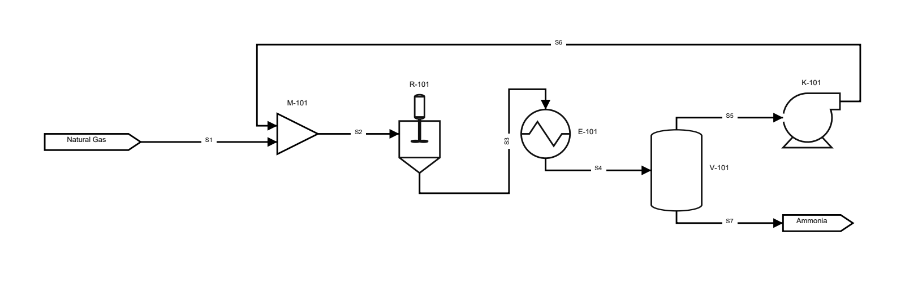

Fully automatic: no coordinates anywhere. Seven units and their connections go
in, and the engine assigns layers, orders them, places them on a common flow
axis and routes every stream. The compressor discharge back to the mixer is
detected as the recycle and carried across the top of the sheet, and the streams
are numbered `S1`…`S7` in creation order.

## 02 · Manual layout, with the coordinate overlay

[`examples/02_manual_layout.py`](../../examples/02_manual_layout.py) ·
[SVG](02_manual_layout.svg)

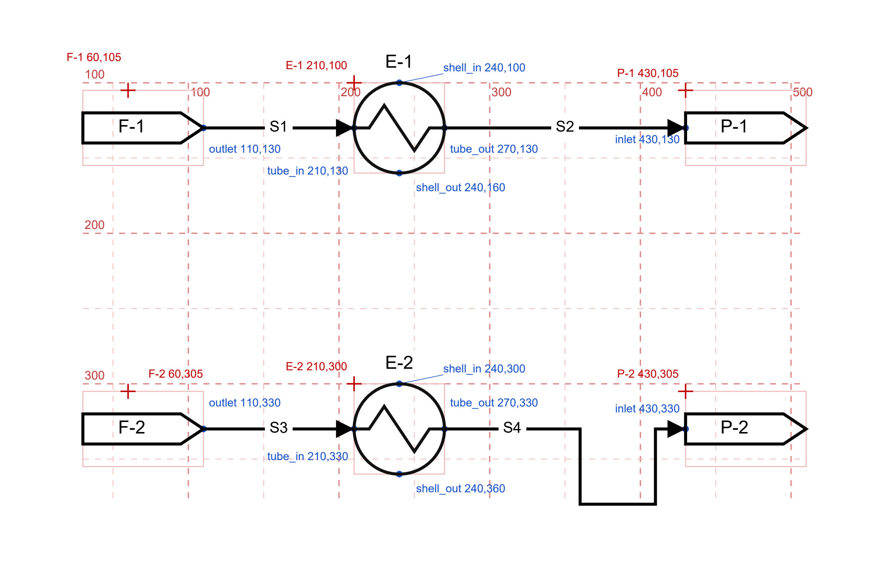

The pixel-level escape hatches, drawn with `debug=True`. The red grid, the red
crosses on every `pin(x=, y=)` corner and the blue dots on every port are the
overlay, not the drawing; it is off by default. The two trains are the same
geometry said two ways — the top pinned by the corner, the bottom pinned by the
nozzle onto one elevation — and the overlay is what shows the difference. The
last run uses `via([...])` to force the stream down, along and back up, an
explicit detour the auto-router would never choose but honours verbatim.

## 03 · Distillation train

[`examples/03_distillation_train.py`](../../examples/03_distillation_train.py) ·
[SVG](03_distillation_train.svg)

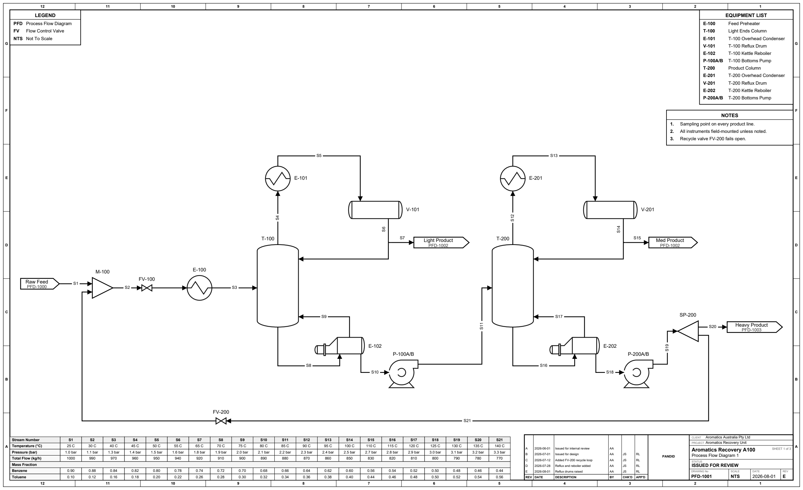

The full engineering sheet: the title block draws the full-width title strip
with its revision history, client and project rows, company cell, issue status
and scale, and `border="zone"` rules the ASME-style zone border around it.
Around that, furniture docked flush to the frame: an auto `equipment_list()`
built from each unit's `description`, numbered `notes()`, and a `legend()`. Along the bottom, the stream property table with a "Mass Fraction"
section header injected via `stream_table_sections`. Two columns, their
overheads and bottoms pumps, a bottoms splitter, and a recycle through FV-200
back to the feed mixer. Boundary flags carry off-page `reference`s.

## 04 · Control loop

[`examples/04_control_loop.py`](../../examples/04_control_loop.py) ·
[SVG](04_control_loop.svg)

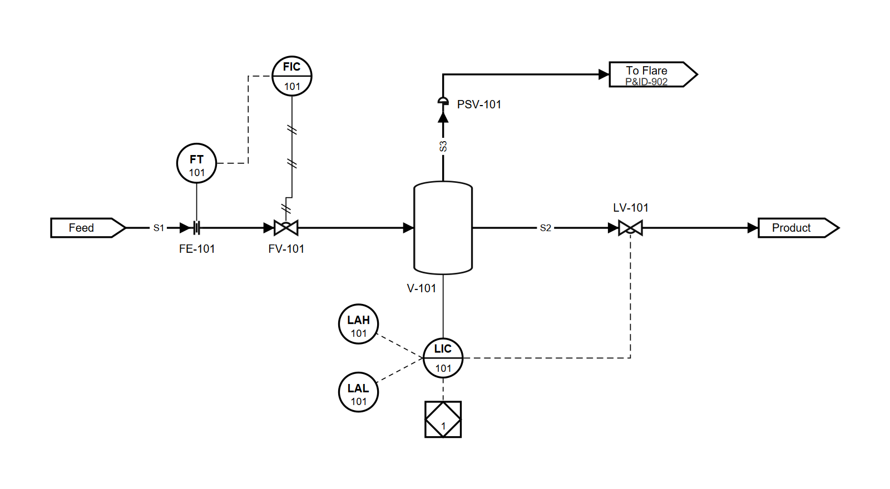

ISA-5.1 instrumentation. Two loops, each closing on a real final control
element: FIC-101 drives FV-101's actuator over a pneumatic line, LIC-101 drives
LV-101 over an electric one. FE-101 sits *on* the line (`offset=0`) with
FT-101 above it on the same tap; LIC-101 mounts on the drum's south face with
its high/low alarms alongside on the same loop number and an interlock square
hung underneath on a dashed line. PSV-101 is an ordinary `Valve(variant="relief")`,
tagged as plain text beside the symbol rather than in a balloon.

## 05 · Reactor recycle

[`examples/05_reactor_recycle.py`](../../examples/05_reactor_recycle.py) ·
[SVG](05_reactor_recycle.svg)

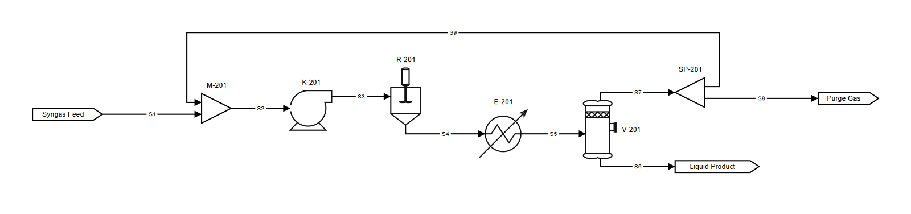

Automatic again, and the clearest demonstration of the straightened spine: feed
→ mixer → compressor → cooler → separator → splitter all land on one horizontal
axis. The splitter purges one outlet to a product flag and recycles
the other back to the mixer; `draw_as_recycle=True` tells the cycle breaker which edge
to tear, and the recycle is routed clear across the top.

## 06 · Column reflux and reboiler

[`examples/06_column_reflux.py`](../../examples/06_column_reflux.py) ·
[SVG](06_column_reflux.svg)

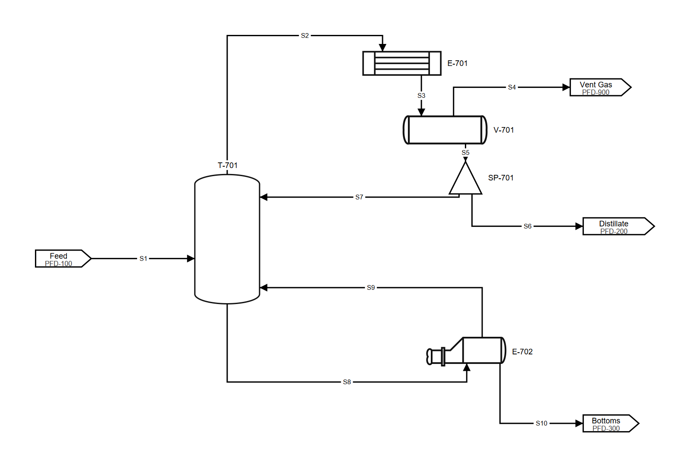

A fractionation sheet drawn the way one actually is: tower on the left,
condenser high and right with the reflux drum beneath it, kettle reboiler off
the bottom. Both loops close on the column itself through its `reflux_in` and
`boilup_in` return nozzles rather than being faked as recycles to an upstream
unit. The sump drains into the kettle and the bottoms product leaves from the
reboiler's own draw at the weir end, so nothing on the sheet is there to make
the topology work. The drum's inlet is authored on three faces and the engine
takes the top one, since the condenser drains straight down onto it, and the
condenser is `mirrored="x"` so it drains toward the drum. Equipment is pinned by
nozzle fraction, which is what makes every run either straight or a single
corner.

## 07 · Metering skid

[`examples/07_metering_skid.py`](../../examples/07_metering_skid.py) ·
[SVG](07_metering_skid.svg)

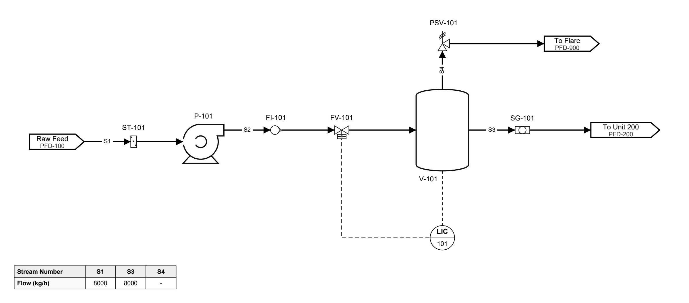

The in-line fitting and actuated-valve families on one spine: a suction
`strainer`, pump, `rotameter`, a `motor`-operated throttle valve, a surge vessel
with a spring `psv` to flare, and a `sight_glass` on the way out. The valve is
`mirrored="y"` so its operator faces down toward the controller instead of
making the signal climb over the vessel, and LIC-101 takes its output on its
west face because that is the side the valve is on. The only rise on the sheet
is across the pump, whose discharge nozzle really is above its suction.

## 08 · Built from data

[`examples/08_from_data.py`](../../examples/08_from_data.py) ·
[SVG](08_from_data.svg)

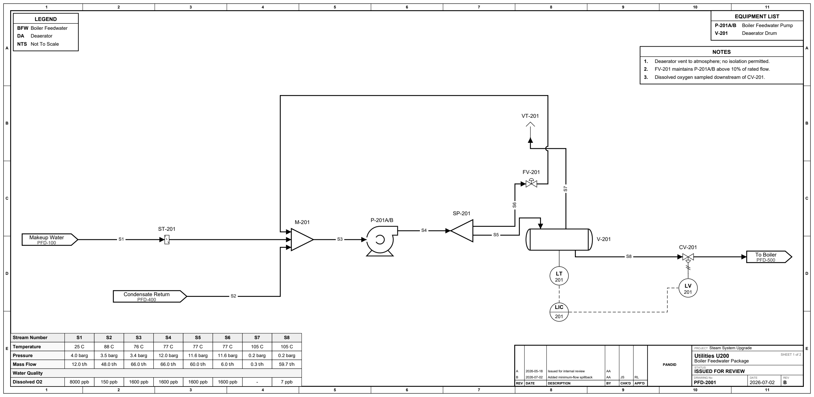

The only example that writes no flowsheet code at all: one plain mapping, the
kind you would keep in a YAML file beside the equipment list it came from,
handed to `Flowsheet.from_dict`. Layout, routing and stream numbering run
exactly as they do for the hand-written sheets, and `to_dict()` writes the same
spec back out.

The process is a boiler feedwater package, and it carries a complete ISA-5.1
level loop: `LT-201` on the deaerator measures, `LIC-201` in the control room
decides, and `LY-201` on the valve acts. An electric signal goes into the
controller, an electric signal comes out of it, and a pneumatic line (solid,
double cross-hatched) strokes the actuator. `M-201` is a three-inlet header, which is
the case that used to have nowhere to put its third stream.

## 09 · Line numbers

[`examples/09_line_numbers.py`](../../examples/09_line_numbers.py) ·
[SVG](09_line_numbers.svg)

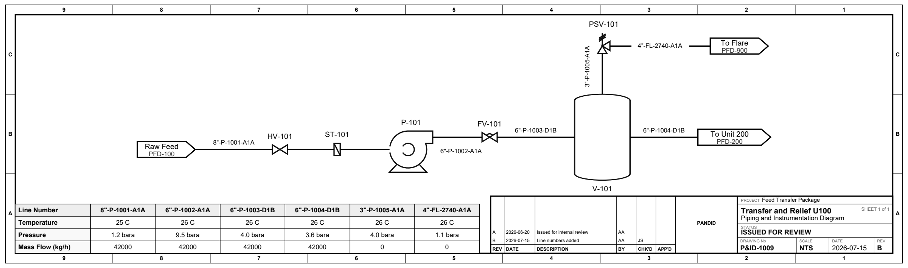

Every line is labelled the way the line list has it, `8"-P-1001-A1A` for size,
service, sequence and spec, instead of `S1`. The components go in on
`connect()`; the sequence is filled by the same numbering that hands out stream
numbers, so nothing has to be kept unique by hand. The suction line keeps one
number through HV-101 and ST-101, and breaks at the two units marked
`new_line_number`: the spec changes A1A → D1B across FV-101, and the size changes
3" → 4" across PSV-101, which is what a spec break is. The tail-pipe to flare
takes its `sequence` by hand, for a line that already exists on someone else's
list. The stream table underneath is headed by the same line numbers, so a
column ties to a line without a second lookup. The sheet is issued as a P&ID
and drawn as one (`diagram="p&id"`), so its process lines carry no arrowheads:
direction on a P&ID is read off the equipment and the line list.

## 10 · Ethanol purification PFD

[`examples/10_ethanol_pfd.py`](../../examples/10_ethanol_pfd.py) ·
[SVG](10_ethanol_pfd.svg)

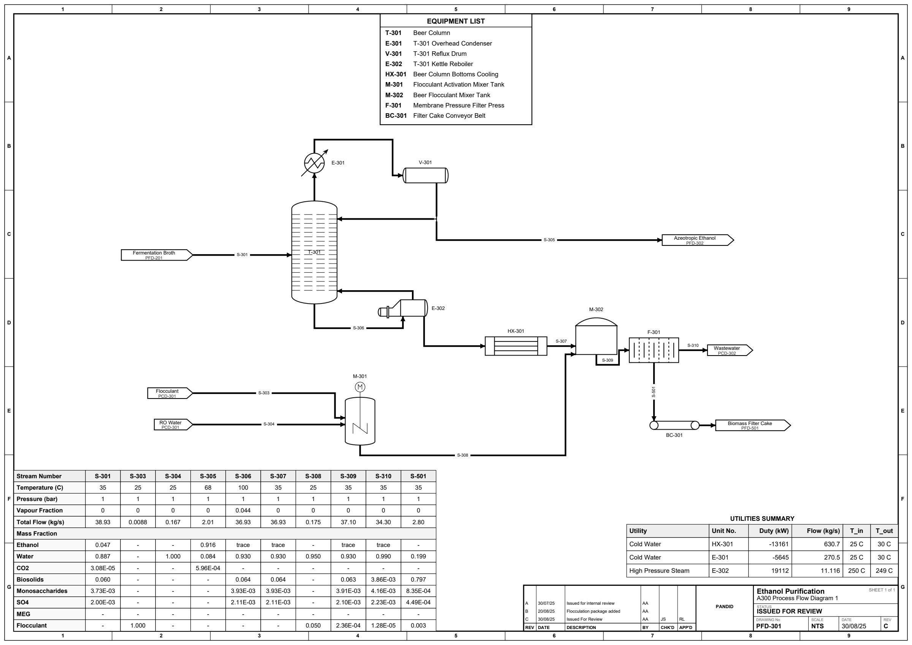

A whole issue-ready sheet, and the one example drawn on a **real A3 page**:
`page_size="A3"` fixes the sheet at 420 × 297 mm, so the SVG declares that
physical size, the zone grid belongs to the page rather than to the drawing,
and the scale cell reports the ratio the drawing was actually placed at. The
furniture rules to the page edges and the drawing is fitted into what is left.

The process is the front end of a fuel-ethanol purification train: beer column
T-301 with its overhead condenser, reflux drum and kettle reboiler, the drum's
draw parting into the reflux the tower needs and the distillate that leaves the
sheet, the bottoms
cooled in HX-301, flocculant made up with RO water in M-301, dosed into the beer
in M-302, and the slurry dewatered in the membrane filter press F-301, whose
cake drops onto the belt BC-301. Both partings are `Tee`s: the reflux one
carries its number straight through, and the press one sets `new_line_number`
and breaks it, because the size and the service both change there. A tee is drawn as
nothing at all and tagged nowhere, so neither puts a symbol on the sheet or a
row in the equipment list. Six
off-page connectors carry the drawing they tie into, the equipment list is named
row by row with `include=`, a `TableBox` carries the utilities summary above the
title strip, and the stream table along the foot is sectioned into a "Mass
Fraction" block. Where the sheet leaves a line unnumbered, as it does on the
tower overhead and the reboiler circuit, the segments share the number of the
stream they serve, so each is drawn once and heads one table column.

## 11 · Ethanol purification P&ID

[`examples/11_ethanol_pid.py`](../../examples/11_ethanol_pid.py) ·
[SVG](11_ethanol_pid.svg)

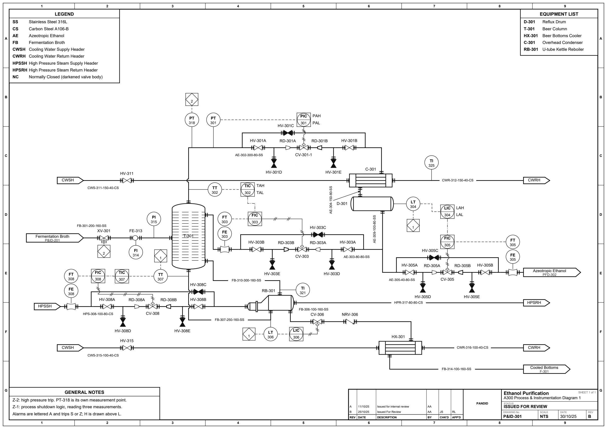

The P&ID counterpart of `10`: the same unit on the same `page_size="A3"` sheet,
drawn as the piping and instrumentation diagram (`diagram="p&id"`, so no
process line carries an arrowhead; compare `10`, which is the same plant as a
PFD and keeps them). Every line is identified by its
line number, and one number runs through the hand valves, the reducers and the
control valve of a station because a station is one line. The overhead, reflux,
distillate and steam control valves are each one `add_valve_station()` call:
isolation valve, drain tee, reduction, control valve, expansion, drain tee,
isolation valve, with a bypass over the top on its own
`normal_position="closed"` valve tapped outside both isolation valves. The four
branches on each are `Tee`s, drawn as nothing at all and scheduled nowhere. The `NC` legend row is what ISA-5.1
clause 2.8.1(b)(1) requires of a sheet that darkens a valve body, since the fill
is a PIP PIC001 convention rather than an ISA one. The reflux flow element
`FE-303`
is a `Fitting` sitting in the run with `FT-303` standing over it. The
cooling-water and steam tie-ins are `header=True` flags, so both supplies read
`CWSH` and both returns `CWRH`, matching the legend rows that explain them.
Five loops close on
a final control element:
`PIC-301` on the tower overhead, `LIC-304` on the distillate, `TIC-307` on the
steam, `LIC-306` on the bottoms draw, and `TT-302 → TIC-302 → FIC-303` cascading
the tower-top temperature onto the reflux flow controller. Every controller and
alarm is drawn as a `shared` display balloon, and the `sis` interlock square is
drawn
at all four places the trip acts. `via()` pins the routes of the lines that carry
balloons, since an attached instrument hangs off the *routed* path and would move
with a line the router was free to re-bend. Nothing on the sheet is pinned by a
measured nozzle offset: `pin(port=…)` asks each symbol where its own nozzle sits.

It is also the one example that shows the **draw.io export**: a second
`fs.render()` on the same flowsheet with the same arguments and a `.drawio` name
writes the editable model, which is
[`drawio-samples/11_ethanol_pid.drawio`](../../drawio-samples/11_ethanol_pid.drawio)
committed. Every flowsheet exports; this is the sheet the line is written on
because it is the densest, so it is the one worth opening in the editor.

## 12 · Block flow diagram

[`examples/12_block_flow_diagram.py`](../../examples/12_block_flow_diagram.py) ·
[SVG](12_block_flow_diagram.svg)

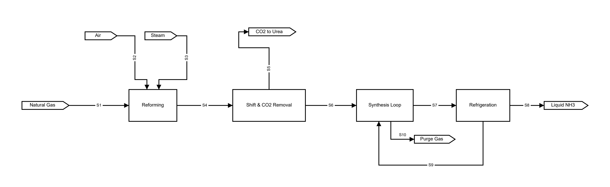

The drawing a level above the PFD: one labelled box per plant section, the
streams between them numbered, and nothing inside them drawn. `units.Block` is
the only symbol on the sheet, and it is the one that connects on all four sides
— `inputs=["W", "N", "N"]` puts air and steam into the reformer from *above*
while the gas comes in from the left, the CO2 leaves the top of the removal
section, and the refrigeration section sends its recycle out of the *bottom* for
the synthesis loop to take back in from below. A plain count is the shorthand
for the usual case: `inputs=1` is one connection on the west. The recycle is
drawn the way a BFD draws one — under the row, from the section that produces it
back to the section that takes it, crossing nothing — which is why the purge
flag is pinned close under the loop rather than at the foot of the sheet: a
block draws every input on a face before every output on it (issue #192), so the
purge has to turn aside above the recycle's channel or the two would cross.
Nothing here carries a `width` or a `height`; each box is as wide as its
own name and as tall as the connections on its walls need, spread at a pitch
that keeps two arrowheads apart, which is why `Shift & CO2 Removal` comes out
wider than `Reforming`. It is pinned because the layout engine ranks by process
flow order and does not yet read a north-face connection as wanting its source
above it (issue #168) — and a BFD is the drawing most worth pinning anyway,
since the reader is meant to see the plant in a row.

## 13 · Mineral concentrate dewatering

[`examples/13_mineral_dewatering.py`](../../examples/13_mineral_dewatering.py) ·
[SVG](13_mineral_dewatering.svg)

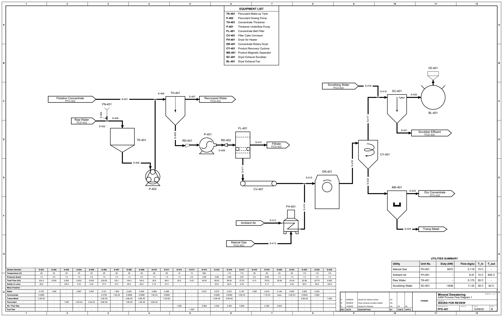

The first sheet here that is not a fluids plant. A flotation concentrate is
thickened in `TH-401`, dewatered on the vacuum belt filter `FL-401`, dropped as
cake onto `CV-401`, dried in the direct-fired rotary drum `DR-401`, recovered
out of its own drying gas by the cyclone `CY-401` and cleaned of tramp steel by
the magnet `MS-401`; the spent gas is scrubbed in `SC-401` and pulled to the
stack `VE-401` by the induced-draught fan `BL-401`. It brings thirteen
`(kind, variant)` symbols into the gallery that were registered and never
drawn — a thickener, a cyclone, a scrubber, a magnetic separator, a belt
filter, a rotary dryer, a furnace, a fan, a conical-bottom tank, a charging
funnel, an exhaust head, a hose pump and a progressing-cavity pump — and it is
the first sheet to build a `Blower`, a `Dryer`, a `Funnel` or a `Furnace` at
all.

It is a **PFD**, on the model of `professional_examples/PFD_301.pdf`: an
equipment list, a sectioned stream table, a utilities summary, and not one
instrument balloon. Four of its five junctions are `Tee(branch="inlet")`s where
a second stream *joins* a run — flocculant into the thickener feed, powder into
the make-up water, burner gas into the dryer's breeching, water into the
scrubber's throat — which is the reverse of the takeoff tees `10` draws and the
only place in the gallery either is shown. Every tee ends a stream number, so
all twenty-four columns of the table are true of the line they name and the
sheet's total-flow balance closes to 0.04 t/h.

Where `10`, `11` and `14` are pinned to A3, this one takes no `page_size` at
all, as `03` and `08` do: twenty-four streams side by side is wider than A3
carries beside a utilities summary, so the sheet is sized to its drawing. It is
the only sheet in the gallery whose *furniture* rather than whose diagram sets
that width.

## 14 · Tank farm and road loading

[`examples/14_tank_farm.py`](../../examples/14_tank_farm.py) ·
[SVG](14_tank_farm.svg)

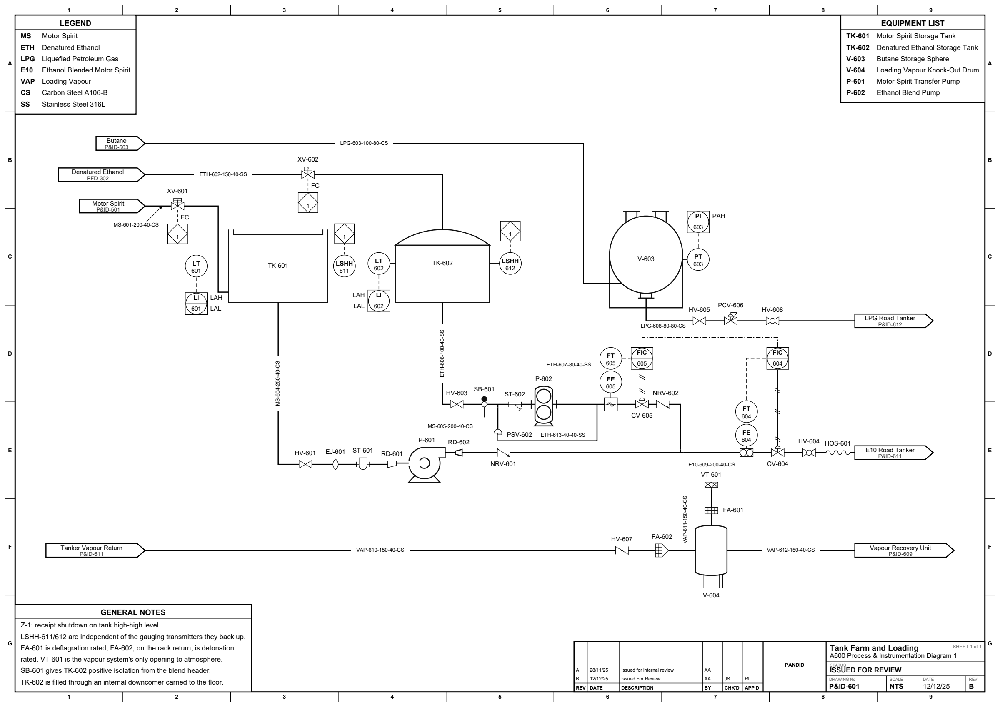

A bulk liquid storage terminal: three storage vessels, the transfer system that
draws them down, the rack that loads road tankers off it and the vapour system
that takes back what the loading displaces. Nothing on it is heated, cooled or
reacted, so it is the sheet that draws containment and line hardware — the
families the reactor-and-column examples never reach for. The three roofs are
three different answers to vapour pressure: an external floating roof over motor
spirit, which deletes the vapour space rather than managing it; a fixed dished
roof over denatured ethanol, kept because a floating roof's rim seal is open to
weather and ethanol takes the rainwater into the product; and a sphere for
butane, which at ambient is a liquid only under its own pressure, and which
therefore needs no pump — `PCV-606`, a self-contained regulator, lets it down
instead. `V-604`'s crown carries the sheet's one opening to atmosphere and both
flame arrestors answer to it: `FA-601` stands *between* the conservation vent and
the drum, because an arrestor has to be on the ignition side of what it protects,
and `FA-602` is detonation rated where `FA-601` is not, because the rack return
gives a deflagration the length of pipe it needs to accelerate in. `RD-601` and
`RD-602` are the eccentric/concentric pair around one pump — flat on top into the
suction so no vapour pocket forms under the crown of the line, symmetric out of
the discharge where the line is pumped full and there is none to trap. Every loop
number here is *allocated*: `add_loop("L")` is written without a number and the
sheet counts out L-601, L-602, P-603, F-604, F-605 in declaration order, which no
other sheet in the gallery demonstrates.
