# Example gallery

These diagrams are generated from the scripts in [`examples/`](../../examples).
Each entry links to its Python source and vector SVG. Rebuild the gallery with
`python scripts/gallery.py`.

## 01 · Ammonia loop

Automatic ammonia-loop layout with a recycle around the main equipment train.

[`01_ammonia_loop.py`](../../examples/01_ammonia_loop.py) · [SVG](01_ammonia_loop.svg)

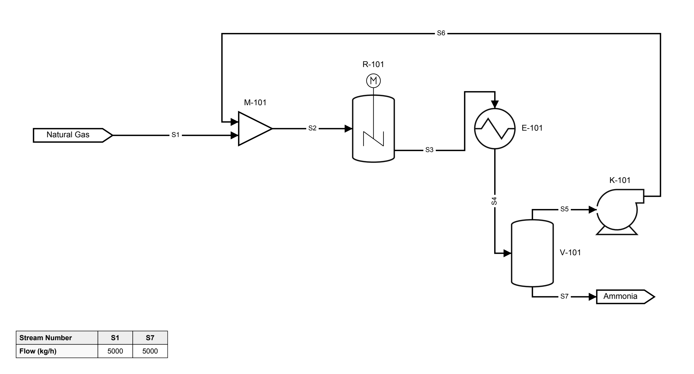

## 02 · Manual layout, with the coordinate overlay

Corner and nozzle pins, manual waypoints, and the debug coordinate overlay.

[`02_manual_layout.py`](../../examples/02_manual_layout.py) · [SVG](02_manual_layout.svg)

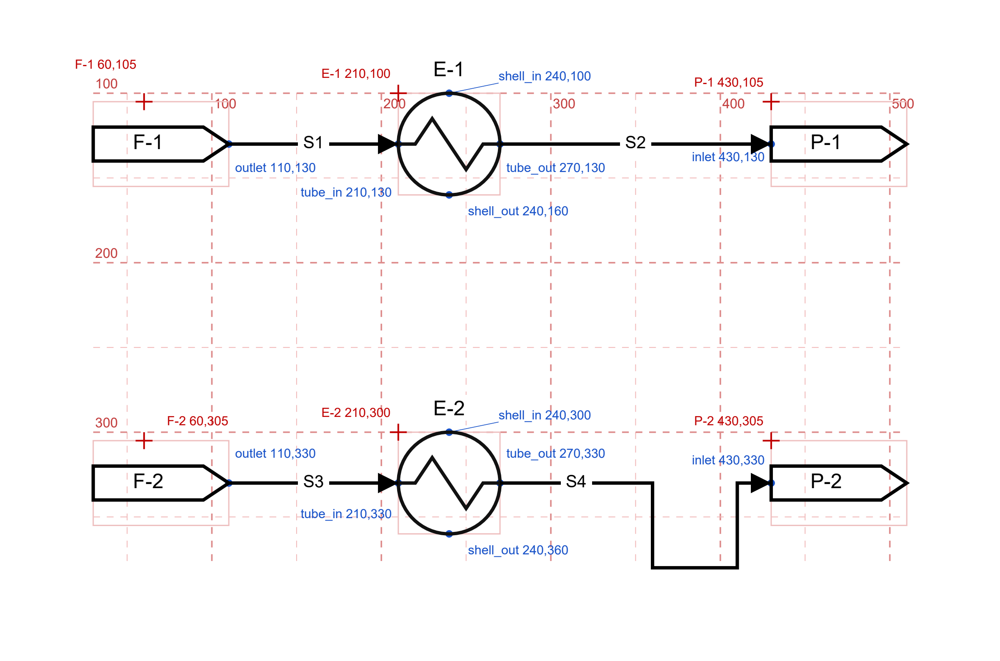

## 03 · Distillation train

Distillation train with a zone border, title block, equipment list, stream table, and recycle.

[`03_distillation_train.py`](../../examples/03_distillation_train.py) · [SVG](03_distillation_train.svg) · [draw.io](../../drawio-samples/03_distillation_train.drawio)

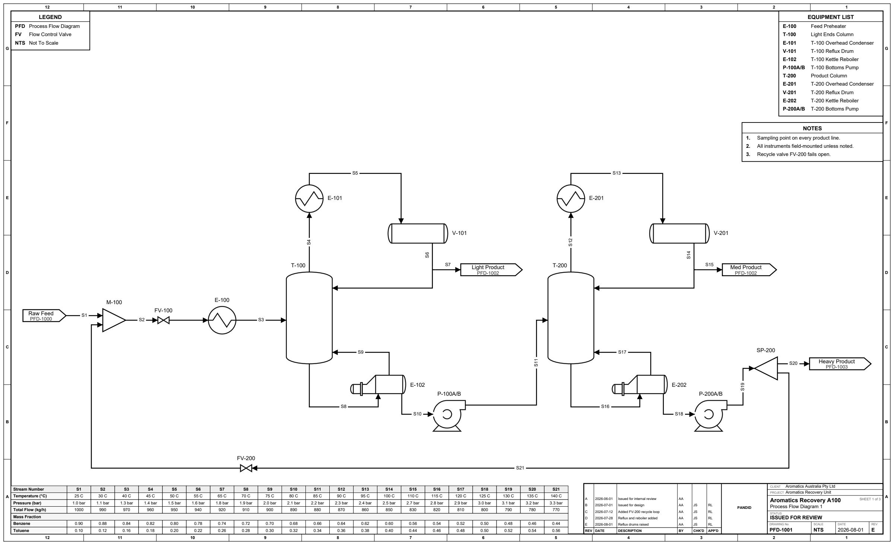

## 04 · Control loop

Two control loops with signal lines, alarms, an interlock, and a relief valve.

[`04_control_loop.py`](../../examples/04_control_loop.py) · [SVG](04_control_loop.svg)

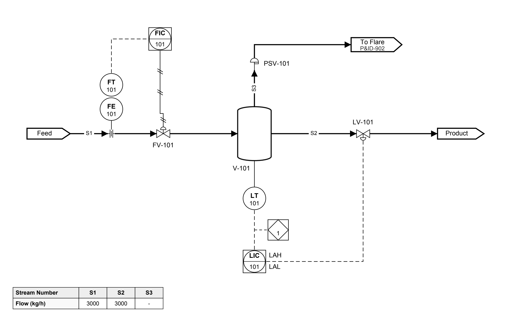

## 05 · Reactor recycle

Automatically placed reactor train with a purge and recycle branch.

[`05_reactor_recycle.py`](../../examples/05_reactor_recycle.py) · [SVG](05_reactor_recycle.svg)

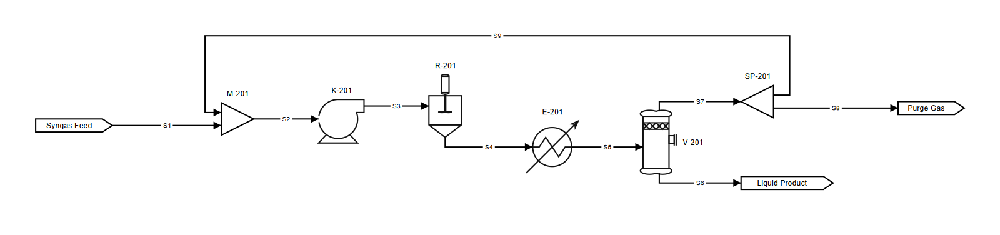

## 06 · Column reflux and reboiler

Column reflux and kettle-reboiler returns with nozzle-based placement.

[`06_column_reflux.py`](../../examples/06_column_reflux.py) · [SVG](06_column_reflux.svg)

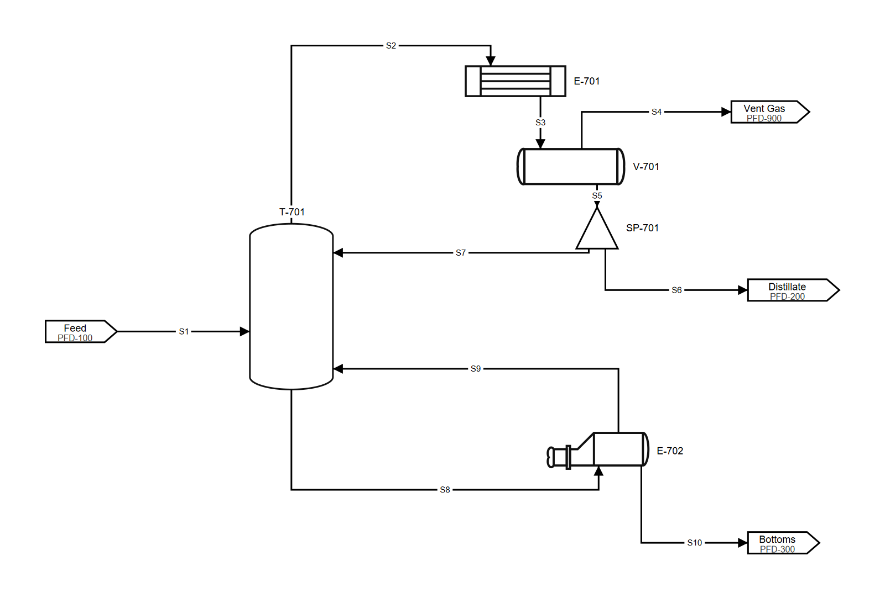

## 07 · Metering skid

Metering skid with inline fittings, an actuated valve, and vessel level control.

[`07_metering_skid.py`](../../examples/07_metering_skid.py) · [SVG](07_metering_skid.svg)

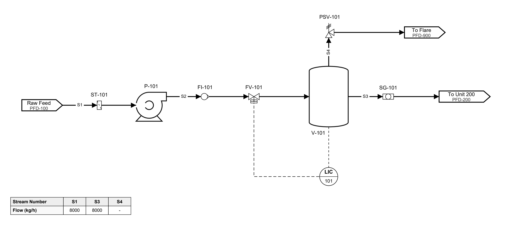

## 08 · Built from data

Boiler-feedwater diagram built from a plain mapping with `Flowsheet.from_dict()`.

[`08_from_data.py`](../../examples/08_from_data.py) · [SVG](08_from_data.svg)

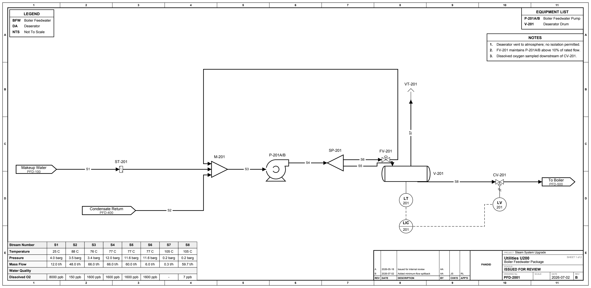

## 09 · Line numbers

P&ID line numbers carried through fittings and broken at specified equipment.

[`09_line_numbers.py`](../../examples/09_line_numbers.py) · [SVG](09_line_numbers.svg)

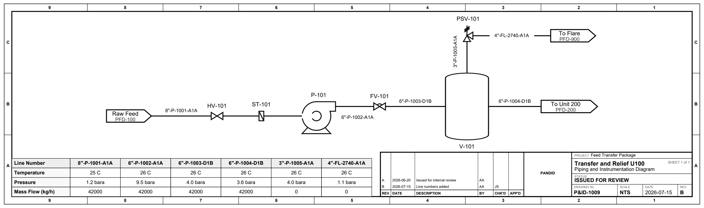

## 10 · Ethanol purification PFD

A3 ethanol PFD with off-page connectors, a utilities summary, and a stream table.

[`10_ethanol_pfd.py`](../../examples/10_ethanol_pfd.py) · [SVG](10_ethanol_pfd.svg)

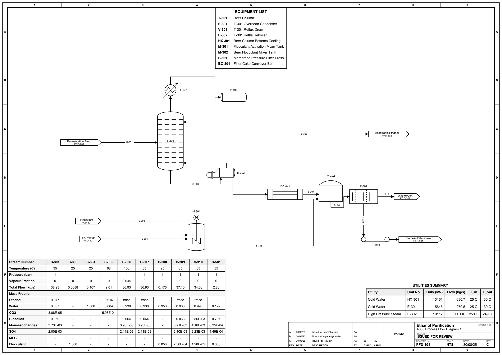

## 11 · Ethanol purification P&ID

A3 ethanol P&ID with valve stations, line numbers, control loops, and interlocks.

[`11_ethanol_pid.py`](../../examples/11_ethanol_pid.py) · [SVG](11_ethanol_pid.svg) · [draw.io](../../drawio-samples/11_ethanol_pid.drawio)

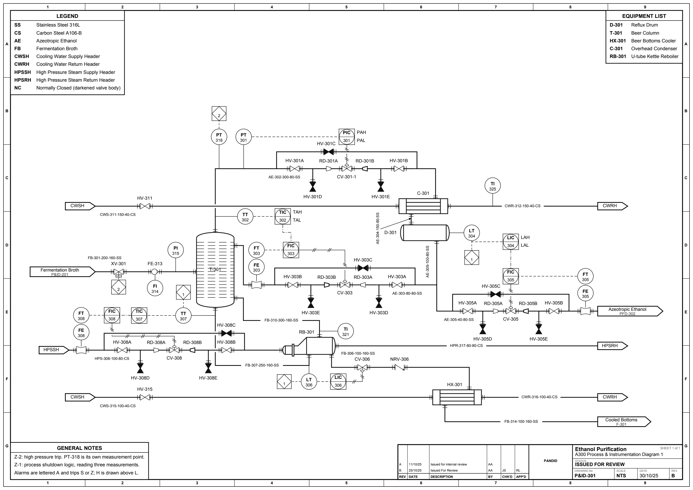

## 12 · Block flow diagram

Block flow diagram with labelled plant sections and connections on several faces.

[`12_block_flow_diagram.py`](../../examples/12_block_flow_diagram.py) · [SVG](12_block_flow_diagram.svg)

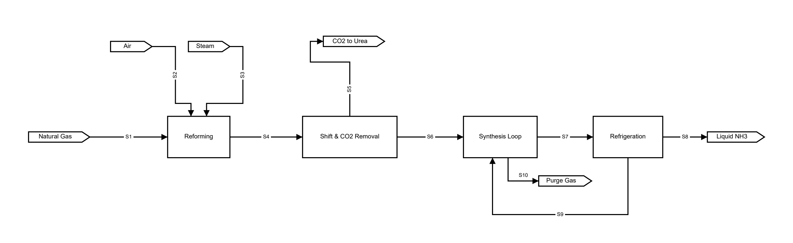

## 13 · Mineral concentrate dewatering

Solids-handling PFD with thickening, filtration, drying, classification, and gas cleaning.

[`13_mineral_dewatering.py`](../../examples/13_mineral_dewatering.py) · [SVG](13_mineral_dewatering.svg)

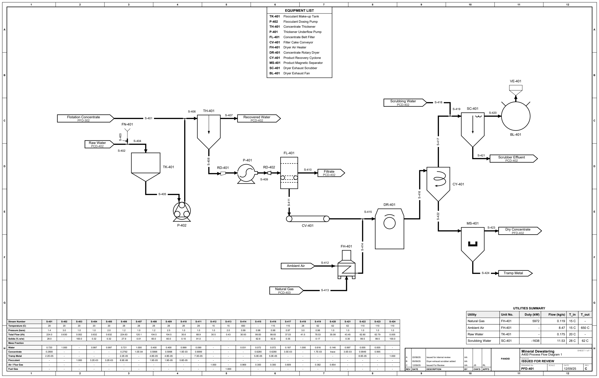

## 14 · Tank farm and road loading

Tank farm and loading rack with vapour handling, pipe hardware, and allocated loop numbers.

[`14_tank_farm.py`](../../examples/14_tank_farm.py) · [SVG](14_tank_farm.svg)

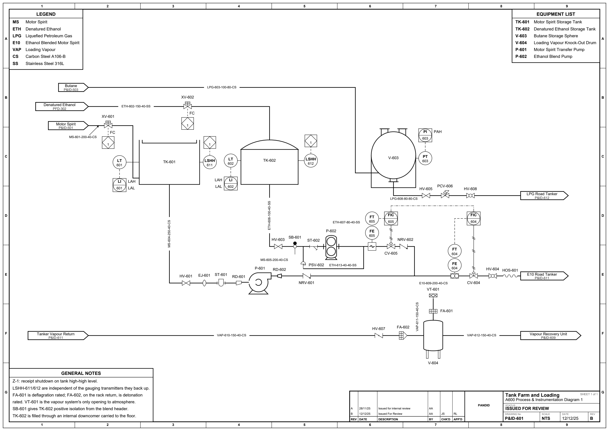

## 15 · Condensing turbine and vacuum system

Automatically placed condensing turbine and vacuum system with instrumentation.

[`15_condensing_turbine.py`](../../examples/15_condensing_turbine.py) · [SVG](15_condensing_turbine.svg)

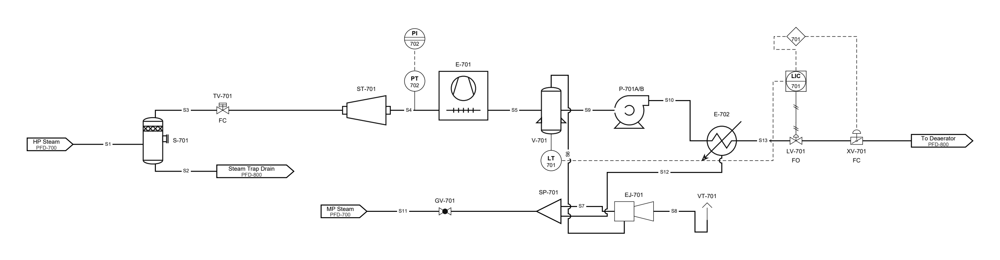

## 16 · Demineralised water plant

Automatically placed demineralised-water train with ion exchange and air stripping.

[`16_demineralised_water.py`](../../examples/16_demineralised_water.py) · [SVG](16_demineralised_water.svg)

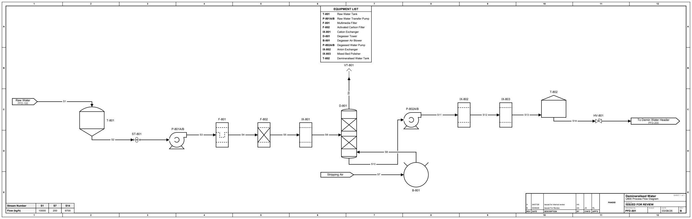

## 17 · Stirred reactor train

Jacketed stirred reactor with cooling control, alarms, and a safety trip.

[`17_stirred_reactor_train.py`](../../examples/17_stirred_reactor_train.py) · [SVG](17_stirred_reactor_train.svg)

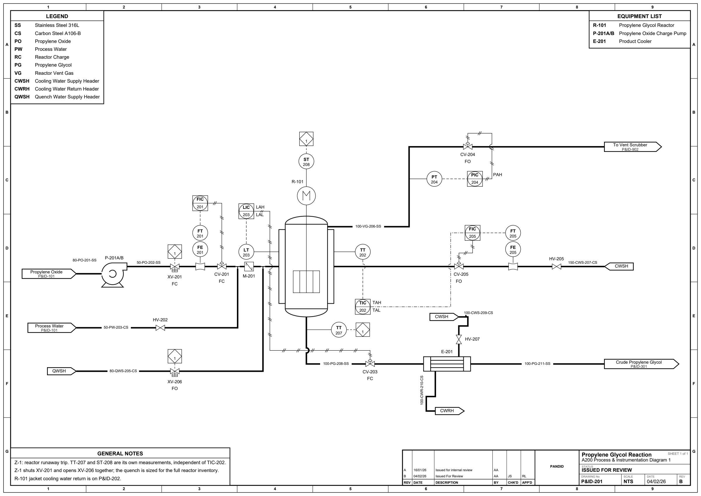

## 18 · Fixed-bed reactor with recycle

Packed-bed methanol-synthesis loop with purge and recycle.

[`18_fixed_bed_recycle.py`](../../examples/18_fixed_bed_recycle.py) · [SVG](18_fixed_bed_recycle.svg)

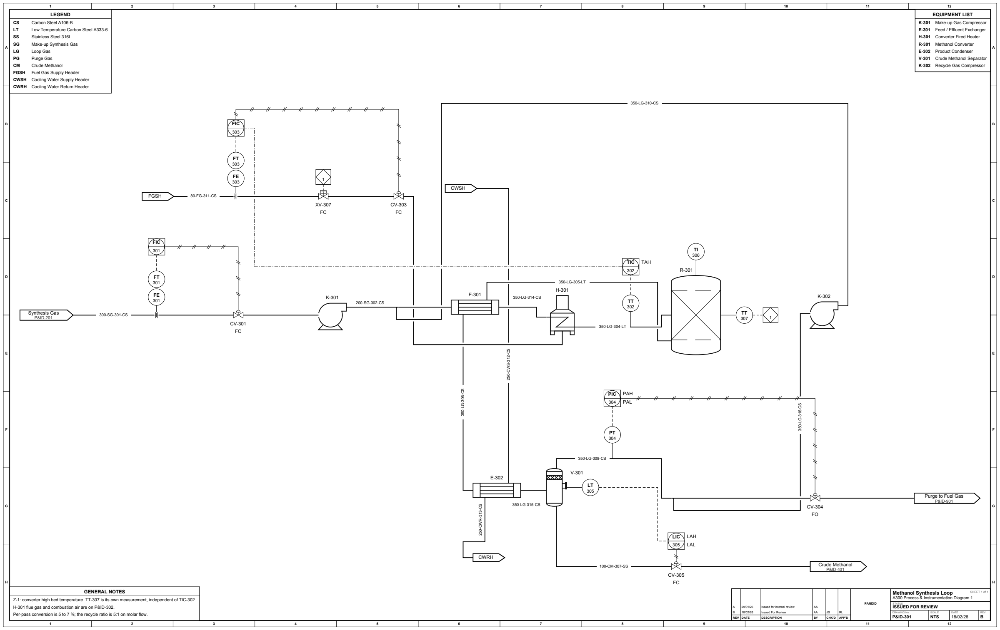

## 19 · Absorber and stripper

Absorber and regenerator with lean/rich exchange and separate column duties.

[`19_absorber_stripper.py`](../../examples/19_absorber_stripper.py) · [SVG](19_absorber_stripper.svg)

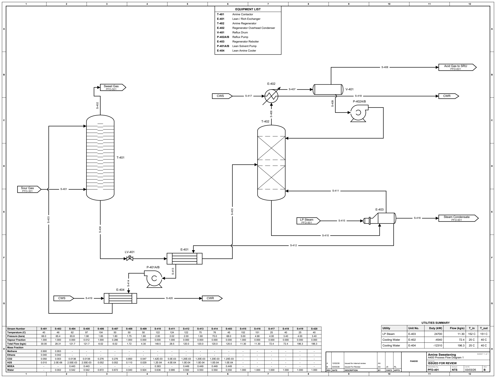

## 20 · Molecular sieve dryer

Two molecular-sieve beds with switching valves and repeated control logic.

[`20_molecular_sieve_dryer.py`](../../examples/20_molecular_sieve_dryer.py) · [SVG](20_molecular_sieve_dryer.svg)

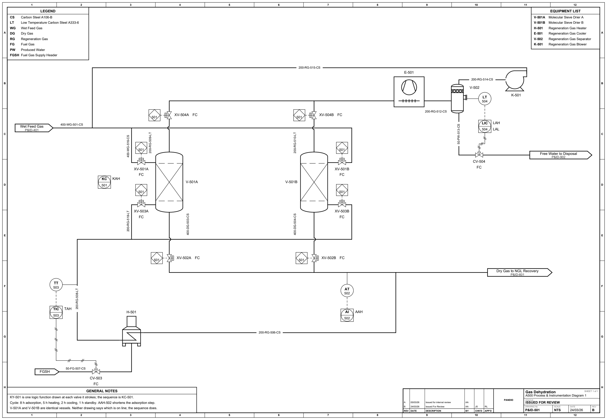

## 21 · Alumina refinery

Bayer-process PFD from crushing to calcination, including the liquor recycle.

[`21_alumina_refinery.py`](../../examples/21_alumina_refinery.py) · [SVG](21_alumina_refinery.svg)

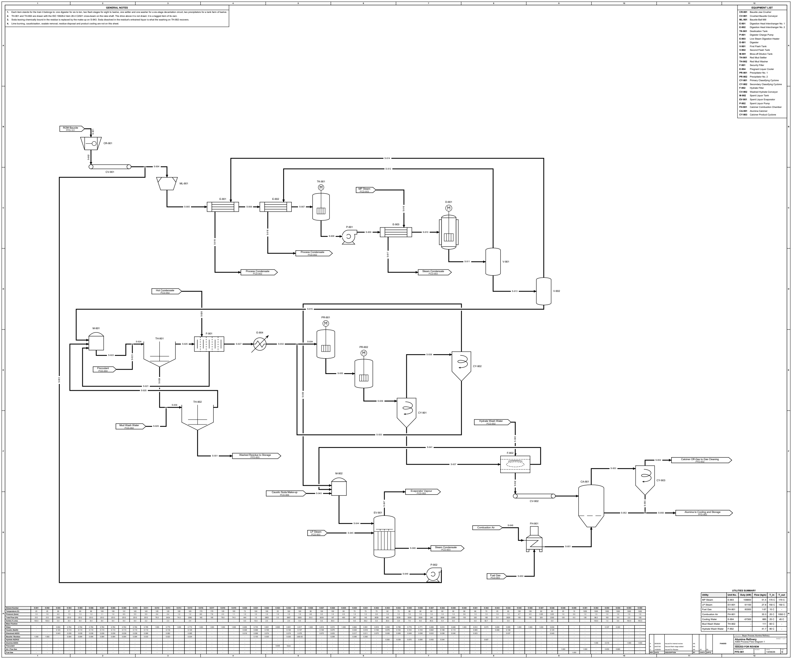
